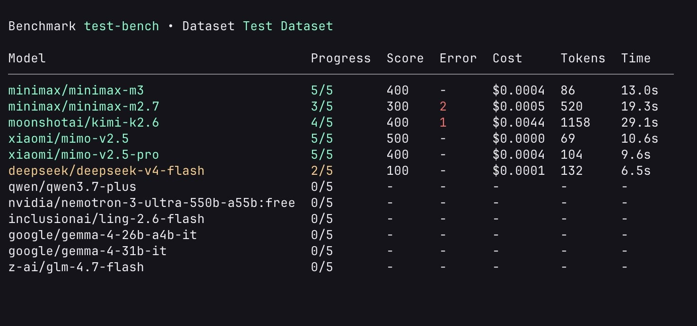

# ai-benchmark

A minimal benchmark harness built so that you can just ask an ai agent to build you any type of ai benchmarks.



## Setup

```bash
pnpm install
export OPENROUTER_API_KEY=sk-or-...
```

## Run Examples

```bash
# using evaluator function
pnpm example1
# using evaluator models
pnpm example2
```

## Features

1. Defining evaluator function.
2. Creating schemas for model responses so that they can be used inside evaluator functions.
3. Defining models using vercel ai sdk
4. Tui with ink and react \:)